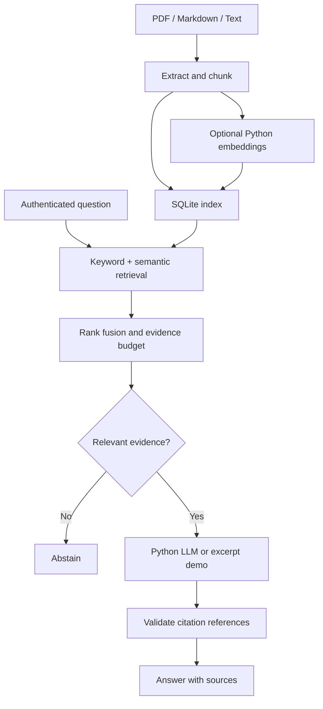

# Production RAG · Python Edition

**Your documents. Relevant evidence. Answers you can trace.**


An end-to-end, **Python-only application** for learning production-oriented
Retrieval-Augmented Generation. Turn PDF, Markdown, and text documents into a searchable
knowledge base, retrieve supporting passages, and generate answers with source citations.

> **Start small, understand every stage, then measure it.**
> Run the offline demo first. Enable local Hugging Face models when you are ready.
> All application code, ingestion, retrieval, inference, API, evaluation, and tests are Python.
> Markdown, TOML, JSON, and GitHub Actions YAML are documentation/configuration—not other
> application languages. Python libraries may internally use native CPU/GPU kernels.

**Status:** portfolio and learning reference, with tested engineering controls.
Real-model quality, load testing, and public deployment still need validation.

[Quick start](#quick-start) · [Architecture](#how-it-works) · [Local LLM](#enable-a-real-local-llm)
· [Hybrid retrieval](#enable-hybrid-retrieval) · [Testing](#testing-and-evaluation)
· [GitHub](#publish-on-github) · [References](#course-reference-and-attribution)

## What you will build

| Capability | Included behavior |
|---|---|
| Document ingestion | PDF, UTF-8 text, Markdown; source and page metadata |
| Document lifecycle | Skip unchanged sources, atomically replace updates, delete, back up |
| Retrieval | BM25 keyword search; optional local semantic embeddings |
| Hybrid ranking | Reciprocal-rank fusion of keyword and vector results |
| Answer generation | Hugging Face Transformers + PyTorch inside the Python process |
| Grounding | Bounded evidence, inline citations, validation of source IDs |
| API | FastAPI with authentication, validation, rate/concurrency limits |
| Operations | Request IDs, structured logs, health checks, basic metrics |
| Verification | Automated tests, sample evaluation dataset, GitHub Actions |

No paid model API is required. Model downloads need internet, and local inference needs
sufficient memory and compute. This project does not require a separate model server.

## How it works



The index supplies evidence; the model writes the answer. A question is answered independently,
without conversation history. This is document RAG, not a text-to-SQL system.

## Quick start

**Requirements:** Python 3.11 or 3.12. Download and extract the repository, then open a terminal
inside the folder containing this README and `pyproject.toml`.

### 1. Create a virtual environment

On **Windows PowerShell**:

```powershell
py -3.12 -m venv .venv
.\.venv\Scripts\Activate.ps1
```

On **macOS / Linux**:

```bash
python3 -m venv .venv
source .venv/bin/activate
```

If PowerShell blocks activation, replace `python` in the following commands with
`.\.venv\Scripts\python.exe`. You do not need to change your machine-wide execution policy.

### 2. Install and configure

These commands are the same on all three platforms after environment activation:

```bash
python -m pip install -r requirements.lock
python -m pip install --no-deps -e .
python -m production_rag init-env
```

`init-env` creates a private `.env` with a random API key. It refuses to overwrite an existing
file. Keep that file private; Git ignores it automatically.

### 3. Index the sample documents and ask

```bash
python -m production_rag ingest data/sample
python -m production_rag ask "How many days of annual leave do employees receive?" --top-k 1
```

The included documents describe a fictional company. The default mode returns excerpts
without downloading a model. A shortened example response looks like this:

```json
{
  "answer": "Retrieved excerpts (offline demo; no LLM synthesis): ...20 days... [1]",
  "abstained": false,
  "mode": "extractive",
  "retrieval": "lexical",
  "citations": [{"citation": 1, "source": "leave-policy.md", "page": 1, "text": "..."}]
}
```

This example is abbreviated. Actual responses also contain chunk IDs and full evidence text.
**Extractive mode is a pipeline demo, not LLM generation.** It cannot reliably decide whether
partially relevant documents answer a question.

### 4. Start the Python API

```bash
python -m production_rag serve
```

Visit **http://127.0.0.1:8000/docs**. Click **Authorize**, enter your key from `.env`, then open
**POST /v1/chat → Try it out** and submit:

```json
{"question": "How many days of annual leave do employees receive?", "top_k": 4}
```

The interactive API docs are supplied by FastAPI; no custom JavaScript frontend is included.
The server binds to localhost. Run `python -m production_rag serve --port 8001` for another port.

## Enable a real local LLM

Install the optional Python model dependencies:

```bash
python -m pip install ".[llm]"
```

Change these values in `.env`:

```dotenv
RAG_GENERATOR=transformers
RAG_LLM_MODEL=Qwen/Qwen2.5-0.5B-Instruct
RAG_LLM_DEVICE=cpu
```

Download/load the model and check the configuration:

```bash
python -m production_rag doctor --load-model
python -m production_rag ask "How much annual leave can I carry over?"
```

Restart the API after configuration changes. Models are loaded lazily and reused within the
API process; separate CLI commands run separate processes and reload model weights.
The first load downloads weights. Later loads reuse Hugging Face's cache.

The example model is deliberately small and is **not a production-quality recommendation**.
It may fail the requested JSON format or generate unsupported statements. Invalid output
is rejected; supported-looking citations still require factual evaluation.

The implementation defaults to CPU and float32 weights. GPU users can set `RAG_LLM_DEVICE=cuda`
or `mps` only when their PyTorch installation and hardware support it. Larger models need
more RAM/VRAM; no automatic quantization or device sharding is implemented.

## Enable hybrid retrieval

```bash
python -m pip install ".[semantic]"
```

Update `.env`:

```dotenv
RAG_RETRIEVAL=hybrid
RAG_DB_PATH=data/hybrid.sqlite3
RAG_EMBEDDING_MODEL=sentence-transformers/all-MiniLM-L6-v2
```

Build the new index:

```bash
python -m production_rag ingest data/sample
python -m production_rag evaluate --output reports/hybrid-evaluation.json
```

BM25 finds exact terms; embeddings help with related meanings. RRF combines their rankings.
The embedding tokenizer bounds chunk lengths. Similarity thresholds need calibration on
real questions; a retrieval score is not a confidence probability.

**Use a new index when changing retrieval mode, embedding model/revision, or chunking.**
The application rejects incompatible index settings. Pin immutable model revisions with
`RAG_EMBEDDING_REVISION` and `RAG_LLM_REVISION` before a controlled release.

## Bring your own documents

```bash
python -m production_rag ingest "path/to/manual.pdf" --source manuals/product-v1.pdf
python -m production_rag ingest "path/to/documents"
python -m production_rag list
python -m production_rag delete manuals/product-v1.pdf
python -m production_rag backup data/backups/index-001.sqlite3
```

- Use documents you are authorized to process. Keep private documents out of Git.
- Directory ingestion uses relative paths as source IDs. Single files default to their filename.
- Use distinct source IDs when different folders contain identically named documents.
- Updating a source replaces its old chunks atomically. A failed replacement keeps the old version.
- Deleting a source file on disk does not delete its index entry; use the explicit delete command.
- Scanned PDFs need OCR first. Complex tables and layouts need extraction review.
- Directory ingestion commits each file separately; it is not a single batch transaction.

## Configuration at a glance

| Setting | Default | Purpose |
|---|---|---|
| `RAG_RETRIEVAL` | `lexical` | `lexical` or `hybrid` |
| `RAG_GENERATOR` | `extractive` | `extractive` or `transformers` |
| `RAG_DB_PATH` | `data/index.sqlite3` | Persistent index |
| `RAG_LLM_MODEL` | `Qwen/Qwen2.5-0.5B-Instruct` | Local generator model |
| `RAG_LLM_DEVICE` | `cpu` | CPU, CUDA, or MPS |
| `RAG_CONTEXT_CHARS` | `6000` | Retrieved evidence character budget |
| `RAG_LLM_CONTEXT_TOKENS` | `4096` | Total prompt/output token budget |
| `RAG_MAX_NEW_TOKENS` | `512` | Maximum generated tokens |
| `RAG_GENERATION_SECONDS` | `90` | Cooperative generation time limit |
| `RAG_API_KEY` | Generated by `init-env` | Private API authentication key |

The input prompt plus output allowance must fit the model context. The code rejects oversized
prompts rather than silently dropping evidence. The generation time limit is cooperative:
model loading, lock waiting, and one slow token step are not covered by a hard deadline.

## Testing and evaluation

```bash
python -m pytest -q
python -m ruff check .
python -m ruff format --check .
python -m production_rag evaluate --output reports/evaluation.json
```

Tests cover ingestion, actual PDF parsing, persistence, atomic updates, backups, authentication,
limits, model-adapter behavior, and invalid citations. The eight synthetic evaluation cases
measure source recall@4, MRR@4, expected answer terms, and abstention.

**A small regression set is not a production accuracy benchmark.** See
[verification results](docs/TEST_RESULTS.md) and [the evaluation plan](docs/EVALUATION.md)
for what was tested and what remains.

## Project guide

| File or folder | What to learn |
|---|---|
| `src/production_rag/documents.py` | Parsing, page metadata, chunking |
| `src/production_rag/store.py` | SQLite transactions and backup |
| `src/production_rag/retrieval.py` | BM25, embeddings, rank fusion |
| `src/production_rag/generation.py` | Local Python inference and citation validation |
| `src/production_rag/service.py` | End-to-end RAG orchestration |
| `src/production_rag/api.py` | API contracts and operational controls |
| `src/production_rag/cli.py` | Python command-line interface |
| `tests/` | Repeatable correctness and failure tests |
| `eval/` | Synthetic regression questions |
| `docs/` | Architecture, learning path, evaluation, deployment guidance |

## From a working demo to production

This version serves **one trusted corpus with one service key**. It is not a multi-tenant system.
Search scans a bounded local corpus; it is not a distributed vector database.

Before serving real users, add and validate end-user authentication, document access controls,
HTTPS, isolated document parsing, shared quotas, load testing, backup operations, dependency
locking for your model platform, and domain-specific faithfulness evaluation.

See [architecture decisions](docs/ARCHITECTURE.md), [production gates](docs/PRODUCTION.md),
and [security guidance](SECURITY.md). Valid citation IDs do not prove that every claim is true.

## Publish on GitHub

Use any GitHub account you own; it does not need to match your ChatGPT account. No plugin is
required. Create a repository named `production-rag`, then upload these extracted files,
including `.github`, `.gitignore`, and `.env.example`. Never upload your private `.env`.

Follow [the GitHub setup guide](docs/GITHUB_SETUP.md). GitHub stores the code and runs CI;
GitHub Pages cannot execute this Python backend or model.

## Course reference and attribution

Learning reference supplied for this project:

- [Course video](https://www.youtube.com/watch?v=qouhIJpp0Is)
- [Course playlist](https://www.youtube.com/playlist?list=PLTHiB6UhbkpgJhgZ0F4u8Jb6U6dLFXM_f)

The course content could not be retrieved during implementation. This code is independently
written and is not presented as a verified reproduction or official course repository.
[REFERENCES.md](REFERENCES.md) records the course link, primary technical sources, and attribution rules.

## Keep learning

Follow the [step-by-step learning path](docs/LEARNING_PATH.md). Next milestones: measure local
model quality, add challenging held-out questions, benchmark hybrid retrieval, and record a
short portfolio demo with honest results.

**License:** [MIT](LICENSE) for original project code. Libraries, documents, and model weights
retain their own licenses.
